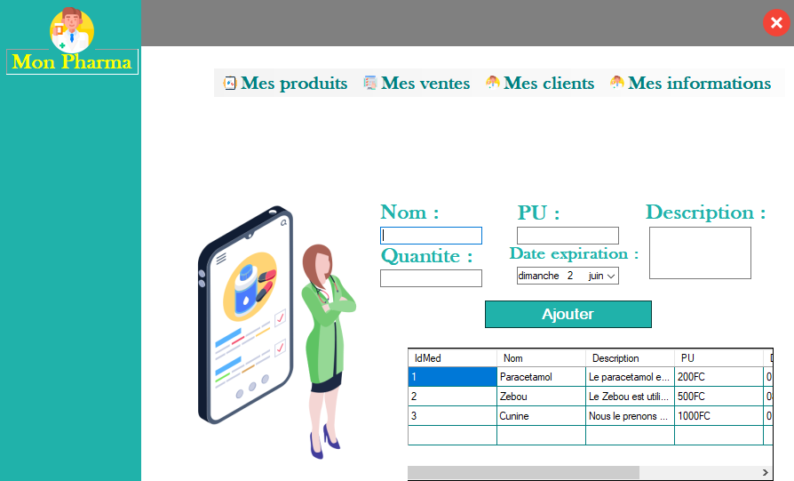

# MonPharma

MonPharma is a pharmacy management desktop application designed to streamline pharmacy operations.

## Features

- **Sales Management**: Record and manage sales transactions.
- **Customer Database**: Maintain a database of customer information for easy access.
- **User-friendly Interface**: Intuitive design for easy navigation and usage.
- **Data Security**: Securely store sensitive pharmacy data.

## Screenshots

## Technologies Used

- **Programming Language**: JavaScript
- **Framework**: .Net
- **Database**: Microsoft Access 2010
- **UI Framework**: Winforms

## Contributing

Contributions are welcome! If you'd like to contribute to MonPharma, please follow these steps:

1. Fork the repository.
2. Create your feature branch: `git checkout -b feature/my-feature`.
3. Commit your changes: `git commit -am 'Add some feature'`.
4. Push to the branch: `git push origin feature/my-feature`.
5. Submit a pull request.

## License

This project is licensed under the [MIT License](LICENSE).

